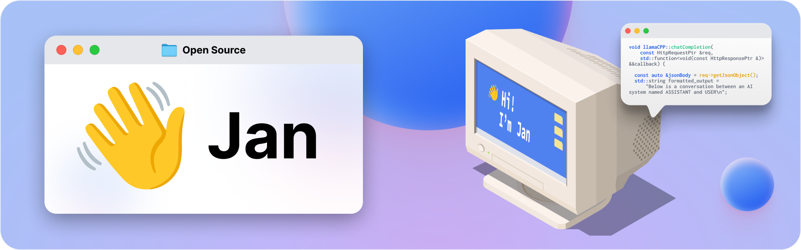
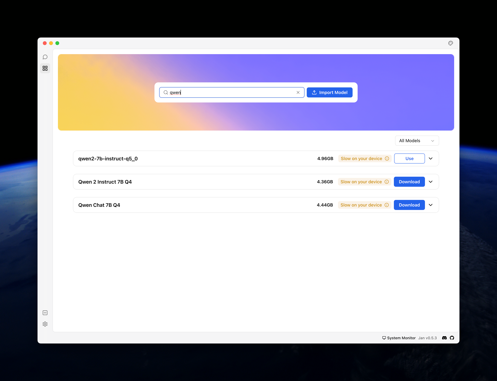
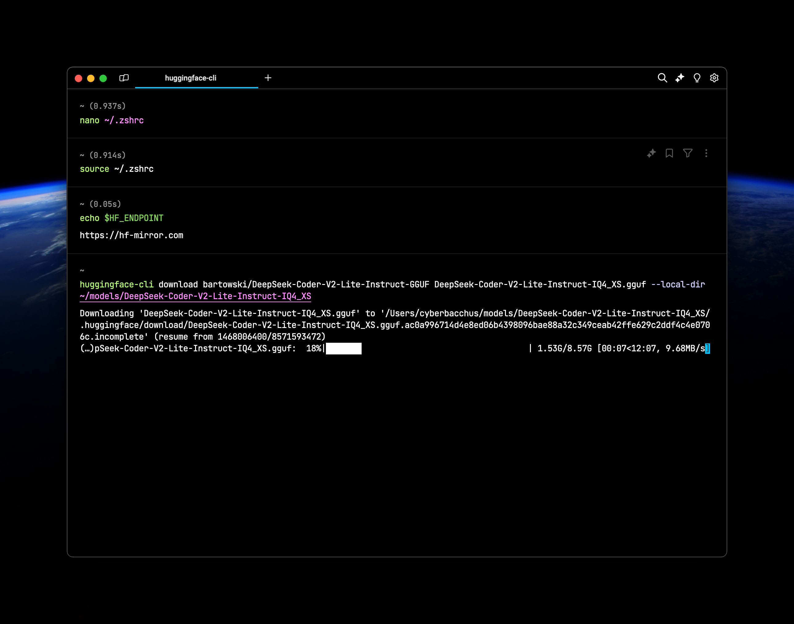

:::note
本文总结我在使用`llama.cpp`在本地部署大语言模型并运行的过程
:::

自从OpenAI在2022年11月推出基于GPT-3.5模型的ChatGPT服务以来，许多人（包括我在内）曾认为，只有闭源的大语言模型（LLM）才能提供优秀的性能，或者只有配备高性能服务器和大量H100显卡的环境才适合部署LLM。

然而，技术的发展和开源社区的贡献已经迅速改变了这一局面。如今，我已经能够在一台16GB内存和残血M1 Pro芯片的MacBook上，用14核GPU运行性能不逊于GPT-3.5的LLM，这确实让人感叹技术扩散的速度之快。

通过使用`llama.cpp`作为后端，结合Jan前端界面，再配合Hugging Face等社区提供的模型资源，我成功实现了快速、流畅的本地大语言模型部署。这个过程不仅让我见识到开源技术的强大，也让我对个人设备上的LLM应用充满了信心。

# 背景

## llama.cpp

::github{repo="ggerganov/llama.cpp"}


[`llama.cpp`](https://github.com/ggerganov/llama.cpp) 是由Georgi Gerganov开发的C++库，旨在高效地在本地环境中运行LLM进行模型推理。


`llama.cpp`利用了许多先进的量化技术，在不影响太多性能的同时减少LLM的体积与显存占用，让LLM在更多计算资源受限的平台实现方便地部署。

## LLM的量化

深度神经网络训练的核心是确定每个神经元的权重参数，通常为16、32或64位浮点数。以LLaMA模型为例，其7B版本包含70亿参数，完整大小为13GB，需要相应的内存和磁盘空间。而通过量化技术，将权重精度降至如4位，可将7B模型压缩至约4GB，从而大幅降低运行要求。

`llama.cpp`需要使用[`gguf`](https://huggingface.co/docs/hub/en/gguf)格式的量化后LLM。我们Hugging Face等网站找模型时，可以在模型名称之外加上gguf作为关键词，找到他人上传的已向量化的模型直接使用。


## Jan

::github{repo="janhq/jan"}

[Jan](https://jan.ai)是一个开源的LLM交互图形界面软件，可以一键调用本地LLM、直接从Hugging Face下载LLM，通过图形化操作省去了Terminal中输入命令的麻烦。同时Jan也提供了常见的LLM API调用支持。



# 实操

本文以下载`qwen2-7b-instruct`模型的5bit量化版与`DeepSeek-Coder-V2-Lite-Instruct`4bit量化版为例，在macOS（配置了Homebrew）中进行操作：

## 下载llama.cpp

```zsh
brew install llama.cpp
```

通过Homebrew可以直接下载预编译后可以直接使用的文件，安装完就可以直接在Terminal中运行`llama-cli`、`llama-server`等命令了，省去了配置C++环境的麻烦。

## 下载Jan

Jan也可以用Homebrew下载，或通过[官网](https://jan.ai)安装

```zsh
brew install --cask jan
```

## 下载Huggingface CLI：

```zsh
brew install huggingface-cli
```

## 下载LLM：通过Jan

Jan中内置了许多常见模型，可以在hub中直接搜索下载。



但Jan对通过Hugging Face链接下载的支持并不好，很多时候我们需要自己下载一些非常见的LLM导入。

## 下载LLM：通过Huggingface CLI


使用Huggingface CLI要注意换源到[国内镜像](https://hf-mirror.com)，可以有效提升下载大模型的速度。方法为：

```zsh
export HF_ENDPOINT=https://hf-mirror.com
```
:::tip
这里也可以`nano ~/.zshrc`编辑到配置文件里去。
:::

随后在Hugging Face找到目标模型的repo：`bartowski/DeepSeek-Coder-V2-Lite-Instruct-GGUF`

这个repo包含许多不同精度的向量化模型，使用如下命令下载单个指定精度的gguf文件：

```zsh
huggingface-cli download bartowski/DeepSeek-Coder-V2-Lite-Instruct-GGUF <文件名> --local-dir <本地路径>
```



安装完gguf文件后，就可以使用LLM了

## 使用LLM：通过llama.cpp CLI

命令行中调用：

```zsh
llama-cli -m ~/models/Llama3.1-8B-Chinese-Chat-GGUF-Q8_0/llama3.1-8b-chinese-chat-q8_0.gguf -c 2048 -p "介绍R语言tidyverse包"
```
运行server在浏览器中使用：

```
llama-server -m ~/models/Llama3.1-8B-Chinese-Chat-GGUF-Q8_0/llama3.1-8b-chinese-chat-q8_0.gguf -c 10000
```

## 使用LLM：通过Jan

通过Jan的Settings面板可以直接导入模型，将下载好的gguf文件拖入即可直接使用。

:::note
其实我之前已经尝试过llama.cpp，但当时还是将它clone下来后`make`，遇到报错后也不知道怎么处理。如今，得益于 Homebrew 提供的可执行文件版本和 Jan 一键导入与配置的便利，整个部署流程变得前所未有的简单高效。可以说，现在本地部署大模型已经被优化得非常用户友好，几乎是把这口“技术饭”直接喂到了嘴边。这也充分体现了开源社区持续推动技术普及的力量，让个人电脑上的大语言模型体验不再遥不可及。
:::